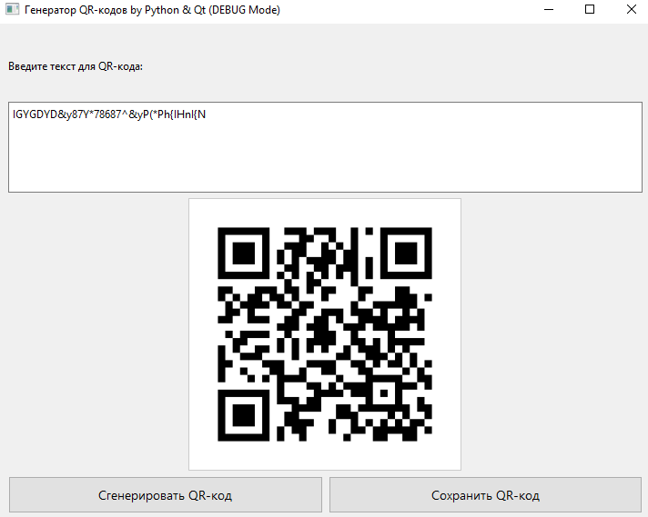

# Генератор QR-кодов на Python и Qt (PySide6)

Простое десктопное приложение для генерации QR-кодов из текстовых данных. Написано на Python с использованием библиотеки PySide6 для графического интерфейса пользователя и библиотеки qrcode для генерации QR-кодов.

 

## Возможности

*   Ввод произвольного текста для кодирования в QR-код.
*   Мгновенное отображение сгенерированного QR-кода.
*   Сохранение QR-кода в форматах PNG или JPG.
*   Простой и интуитивно понятный интерфейс.
*   Кроссплатформенность (протестировано на Windows 10/11, должно работать на Linux/Ubuntu при наличии зависимостей).

## Требования

*   Python 3.8+
*   Библиотеки Python (устанавливаются через pip):
    *   `PySide6`
    *   `qrcode`
    *   `Pillow` (обычно устанавливается как зависимость `qrcode[pil]`)
    *   Для сканирования с экрана `pyzbar` `opencv-python` `numpy`

## Установка и запуск

1.  **Клонируйте репозиторий (или скачайте исходный код):**
    ```bash
    git clone https://github.com/Mythological/QR-generator.git 
    cd QR-generator
    ```
    
2.  **Создайте и активируйте виртуальное окружение (рекомендуется):**
    ```bash
    python -m venv .venv
    ```
    *   Для Windows:
        ```bash
        .venv\Scripts\activate
        ```
    *   Для Linux/macOS:
        ```bash
        source .venv/bin/activate
        ```

3.  **Установите зависимости:**
    ```bash
    pip install PySide6 qrcode Pillow pyzbar opencv-python numpy
    ```

4.  **Запустите приложение:**
    ```bash
    python QR_generate.py 
    ```

## Использование

1.  Введите текст, который вы хотите преобразовать в QR-код, в текстовое поле.
2.  Нажмите кнопку "Сгенерировать QR-код".
3.  Сгенерированный QR-код появится в области предпросмотра.
4.  Чтобы сохранить QR-код, нажмите кнопку "Сохранить QR-код" и выберите местоположение и имя файла.

Что-бы создать exe файл:
```
pip install pyinstaller
pyinstaller --onefile --windowed --name "QRGenerator" --icon="qr.ico" --add-data "qr.png:." QR_generate.py
```

## Возможные улучшения (TODO)

*   [ ] Добавить выбор уровня коррекции ошибок QR-кода (L, M, Q, H).
*   [ ] Добавить возможность изменять цвета QR-кода.
*   [ ] Добавить опцию для встраивания логотипа в центр QR-кода.
*   [ ] Улучшить обработку очень длинных текстов (возможно, с предупреждением или автоматическим увеличением версии QR).
*   [ ] Упаковка приложения в исполняемый файл (например, с помощью PyInstaller или cx_Freeze).
*   [ ] Добавить больше локализаций интерфейса.

## Донат:

BTC: bc1qna64m0wpelkhy3vwhctvpp5g2elsqhj4ykyfgs

ETH: 0x91b86a88c8deb74da72db8743e60f8f6b104e263

USDT TRC20: TFGXNg8GGYQJBAGjZ4bmWHuCTznSmyNqMp

LTC: ltc1qprphmcj7dncdj4k0aucuw43axefyvmdx22tcw5

DOGE: DJmwXWqqmhGy1cSFmgxakP4YhA3PEKksgT

Solana: DmfDLbkHRqhd3LRoGgWpdWLcDAT3dk1wZdSD2sZoGfNe

## Лицензия

Этот проект распространяется под лицензией MIT. Подробнее см. файл `LICENSE`.

## Участие

Если вы хотите внести свой вклад, пожалуйста, создайте форк репозитория, внесите изменения и отправьте pull request. Также можно создавать issue для сообщения об ошибках или предложений по улучшению.
